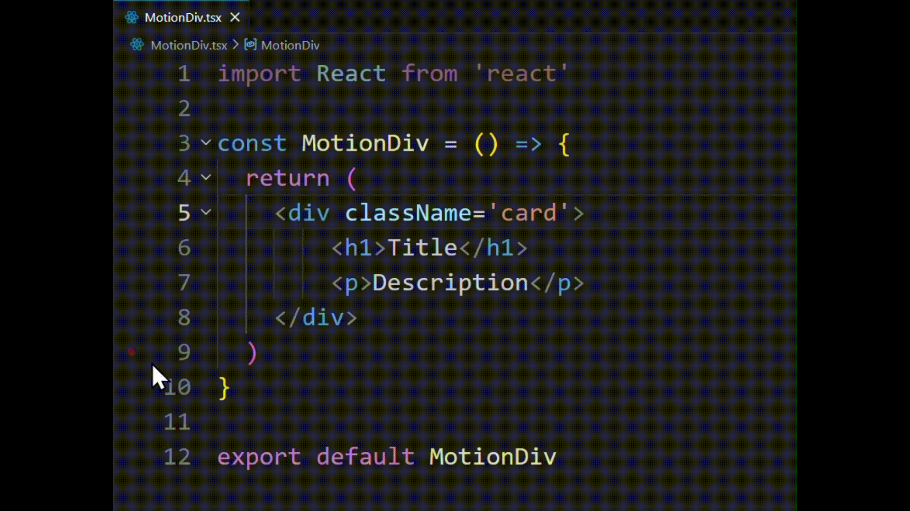
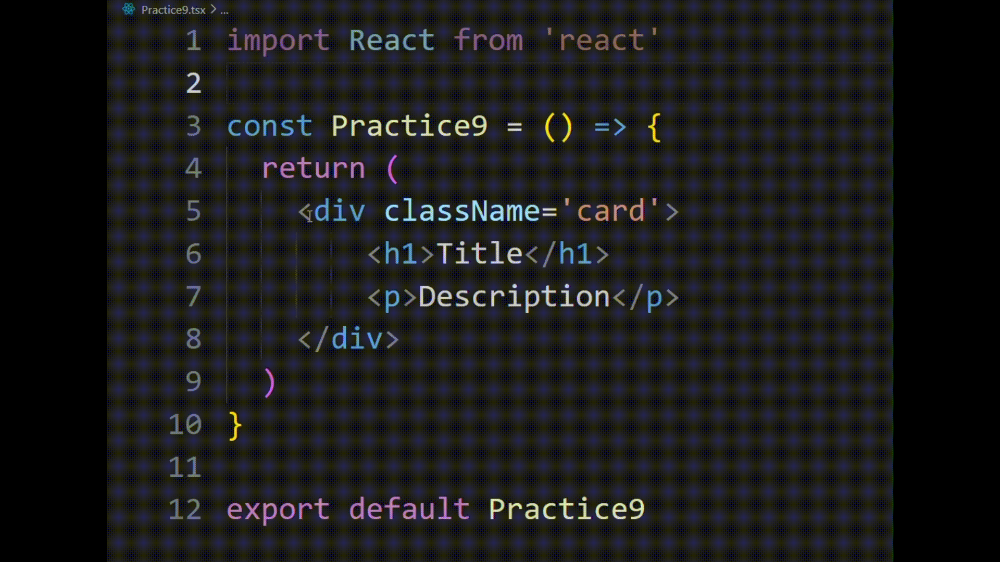

<h1  style="font-size: 4rem;">
  
  MotionDiv
</h1>

Convert any React `<div>` into a `motion.div` instantly.

Select a `<div>` and press `Ctrl + Shift + M`.

Automatically handles `"framer-motion"` → `"motion/react"` imports.





## Example Workflow

### Manual

```text
Select div
↓
Import motion
↓
Change opening tag
↓
Change closing tag
↓
Verify everything
```

### MotionDiv

```text
Select div
↓
Shortcut
↓
Done
```

### Real Workflow




## Features

* Convert `div` → `motion.div`
* Automatically adds or updates Motion imports
* Works directly inside VS Code
* Fast keyboard-driven workflow
* Saves repetitive editing time

## Installation

1. Open VS Code
2. Open Extensions
3. Search for **MotionDiv**
4. Click Install

## Usage

### Keyboard Shortcut

```text
Ctrl + Shift + M
```

### Command Palette

```text
MotionDiv: Convert Div to MotionDiv
```

1. Select a div element
2. Press `Ctrl + Shift + M`
3. Done

## Before

```tsx
<div className="card">
  Content
</div>
```

## After

```tsx
<motion.div className="card">
  Content
</motion.div>
```

## What's Next?

MotionDiv currently supports converting `div` elements.

Support for additional HTML elements is planned for future updates.

## Feedback

Found a bug or have a feature request?

Open an issue on GitHub.
